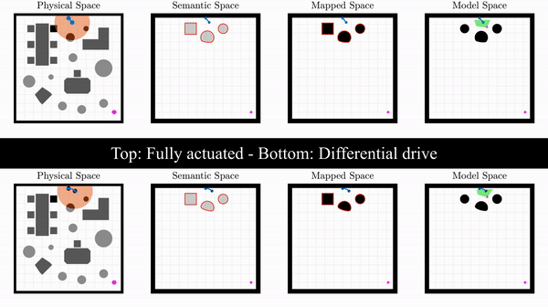

# MATLAB Simulation of Reactive Navigation In Non-Convex Planar Environments

This package communicates with the Python scripts of the [semnav](https://github.com/vvasilo/semnav) package, to simulate doubly reactive navigation with semantic feedback in MATLAB. Except for diffeomorphism-based navigation, the simulation also includes support for RRT-X, by Otte et al. 

It is currently supported only for Ubuntu and Mac.

Maintainer: Vasileios Vasilopoulos (<vvasilo@seas.upenn.edu>)

## Relevant publications and packages
The simulation code included in this package has been used in the following papers:
* V. Vasilopoulos, G. Pavlakos, S. L. Bowman, J. D. Caporale, K. Daniilidis, G. J. Pappas, D. E. Koditschek, "Reactive Semantic Planning in Unexplored Semantic Environments Using Deep Perceptual Feedback" (*under review*).
* V. Vasilopoulos, G. Pavlakos, K. Schmeckpeper, K. Daniilidis, D. E. Koditschek, "Reactive Navigation in Partially Familiar Planar Environments Using Semantic Perceptual Feedback", arXiv:2002.08946.

The doubly-reactive operations in the model space are based on the papers:
* Arslan, O., and Koditschek, D. E., "Exact Robot Navigation using Power Diagrams", *IEEE International Conference on Robotics and Automation* (ICRA '16), 2016, pp. 1-8.
* Arslan, O., and Koditschek, D. E., "Sensor-based Reactive Navigation in Unknown Convex Sphere Worlds", *The 12th International Workshop on the Algorithmic Foundations of Robotics* (WAFR), 2016.

The RRT-X implementation is adapted from [this](https://github.com/rahul-sb/RRTx) package.

## Getting started
* Make sure that [semnav](https://github.com/vvasilo/semnav) is downloaded on your machine (you don't have to necessarily install it).
* Open [this](startup.m) script and:
    1. Modify your Python path (`path_python_ubuntu` or `path_python_mac`) depending on whether you work on Ubuntu or Mac.
    1. Modify the path to semnav (`path_semnav_ubuntu` or `path_semnav_mac`) depending on whether you work on Ubuntu or Mac.
    1. (Mac users might also need to specify the `path_packages` variable.)
* Run [startup.m](startup.m) to load Python and semnav.
* If it doesn't already exist, make a folder called `multimedia`.

## Running the simulation
* In order to run the simulation, you need to make a scenario. Many examples of scenarios are included in the corresponding [scenario.m](demo/scenario.m) file. We suggest copying one of them and modifying it appropriately for your case. Scenario parameters and their meaning are described near the top of the file.
* You also need to add/modify the plot options corresponding to your scenario number in [option.m](demo/option.m). You can start by just using the default settings.
* Then:
    1. In order to run the diffeomorphism-based doubly reactive navigation scheme, you need to call [demoDiffeo](demo/demoDiffeo.m) with the number of your scenario. An example of how the simulation would look like for a fully actuated and a differential drive robot is shown below. We also include [vectorField.m](demo/vectorField.m) if you need to see the generated vector field, assuming no prior memory for the robot.

    

    2. In order to run RRT-X, you need to call [demoRRT](demo/demoRRT.m) with the number of your scenario. We include an example below.

    

Both files include several parameters (`flagSaveVideo`, `flagSaveGif`, `flagSaveFigure`) that can be set to 1 or 0 to toggle output. All generated multimedia files are saved in the `multimedia` folder. We also include a [jobs.m](demo/jobs.m) file for multiple simulation jobs.
